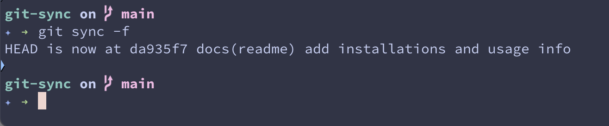

---

<h1 align="center">git sync alias</h1>

<p align="center">
    A Git alias for e nhanced sync functionality with basic automatic conflict resolution.
    <br />
    <br />
    <a target="_blank" href="https://mat-m.com">Check my website</a>
    ·
    <a target="_blank" href="https://bsky.app/profile/mat-m.com">Follow me on Bluesky</a>
  </p>
</p>

### Manual Installation
```bash
# Download the installer
curl -O https://raw.githubusercontent.com/mtmr0x/git-sync-alias/main/install.sh

# Run it
sh install.sh
```

Or run this in your terminal:
```bash
git config --global alias.sync '!f() {
    # Check for continue flag first
    if [ "$1" = "-continue" ]; then
        git rebase --continue
        return
    fi

    # Check if we are in the middle of a rebase
    if [ -d "$(git rev-parse --git-dir)/rebase-merge" ] || [ -d "$(git rev-parse --git-dir)/rebase-apply" ]; then
        # If we get -t or -o during a rebase conflict, abort and restart with that strategy
        if [ "$1" = "-t" ] || [ "$1" = "-o" ]; then
            echo "Conflict detected. Aborting current rebase and restarting with $1 strategy..."
            git rebase --abort

            # Store current branch for reuse
            current_branch=$(git rev-parse --abbrev-ref HEAD)

            # Convert -t/-o to full strategy option
            if [ "$1" = "-t" ]; then
                git rebase --strategy-option=theirs origin/$current_branch
            else
                git rebase --strategy-option=ours origin/$current_branch
            fi
            return
        fi
    fi

    remote="origin"
    force=false
    branch=""
    strategy=""

    # Parse options
    while getopts "fr:t:o" opt; do
        case $opt in
            f) force=true ;;
            r) remote=$OPTARG ;;
            t) strategy="--strategy-option=theirs" ;;
            o) strategy="--strategy-option=ours" ;;
            \?) echo "Invalid option: -$OPTARG" >&2; return 1 ;;
        esac
    done

    # Shift past the options
    shift $((OPTIND-1))

    # Get branch name from argument or current branch
    if [ -n "$1" ]; then
        branch=$1
    else
        branch=$(git rev-parse --abbrev-ref HEAD)
    fi

    # Fetch from specified remote
    git fetch $remote

    # Perform sync based on force flag
    if [ "$force" = true ]; then
        git reset --hard $remote/$branch
    else
        if [ -n "$strategy" ]; then
            git rebase $strategy $remote/$branch
        else
            git rebase $remote/$branch
        fi
    fi
}; f'

```

## Usage

After installation, you can use the following commands:

```bash
git sync                     # Basic rebase (current branch)
git sync feature-branch      # Basic rebase (specific branch)
git sync -f                  # Force reset
git sync -f feature-branch   # Force reset (specific branch)
git sync -r upstream         # Different remote
git sync -t                  # Auto-resolve conflicts favoring their changes
git sync -o                  # Auto-resolve conflicts favoring our changes

# you can run the commands below without having to abort the conflict, the sync does it for you
git sync -t feature-branch   # Auto-resolve conflicts favoring their changes (specific branch)
git sync -o feature-branch   # Auto-resolve conflicts favoring our changes (specific branch)
```

## How it works

This package installs a git alias that enhances the sync workflow. It adds the alias to your global git configuration, making it available for all your git repositories.

For more details, see the [documentation](https://github.com/YOUR_USERNAME/git-sync-alias).

